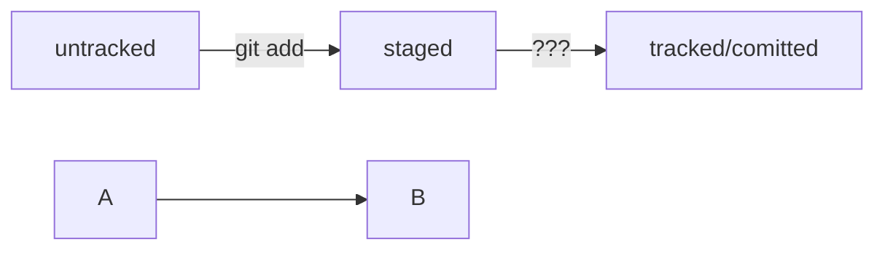

# Шпаргалка markdown

## Выделение текста

Вы можете выделять текст в markdown с помощью символов `_` или `*`. Например:

Пример _курсива_ и **жирного** текста.

## Заголовки

Заголовки можно создавать с помощью символа `#`. Чем больше `#`, тем меньше заголовок. Например:

# Заголовок первого уровня
## Заголовок второго уровня
### Заголовок третьего уровня

## Выделение кода

Чтобы выделить текст как код, поместите его в тройные кавычки `````. 

```bash
mkdir my_project
cd my_project
git init
```
Это лишь некоторые функции markdown.
[Шпаргалка по markdown](https://gist.github.com/fomvasss/8dd8cd7f88c67a4e3727f9d39224a84c "русскоязычная шпаргалка на github")

Ссылка на соглашение о написании комментариев к коммитам: https://www.conventionalcommits.org/ru/v1.0.0-beta.4/#спецификация

В md-файл можно добавлять схемы!
Вот тут полное руководство: https://github.blog/2022-02-14-include-diagrams-markdown-files-mermaid/

